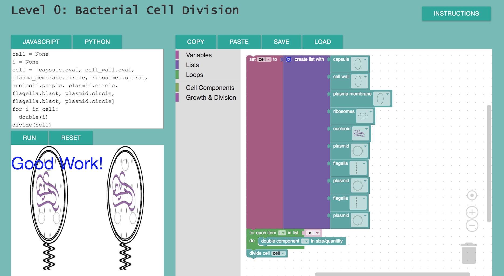

[GermCraft](localhost:3000/)
------
BRBT (Biophysics Research for Baltimore Teens) is a Hopkins Biophysics initiative to provide 6-week paid summer internships to Baltimore City high school students to learn more about biophysics and its related sciences. Typically, the main skills learned throughout this experience are basic biochemistry, lab techniques, and some computation. Starting in the summer of 2019, the Roberts Lab will now offer a BRBT course that emphasizes the computational side of biophysics through [GermCraft](localhost:3000/)——a web application that allows students to code via draggable blocks to emphasize the logic of computer science rather than any language-specific syntax. The blocks were inherited and adapted from Google's [Blockly](https://developers.google.com/blockly/), and the web application and backend development utilizes [Meteor](https://www.meteor.com) software. There are daily GermCraft coding exercises that reinforce the biology concepts learned earlier in the day with a computer science framework that gradually increases in complexity. The ultimate goal of the GermCraft exercises is to allow the students to develop a simulation of cellular behavior and survival. A finished example of the first level is shown below:

At the end of each week, there will be a server competition that allows the students to compete their cell simulations against each other to gather population statistics——and also to see which student created the most efficient cell! Throughout the course, time will be set aside to analyze server competition data to emphasize the importance of data collection and analysis/inference. 
